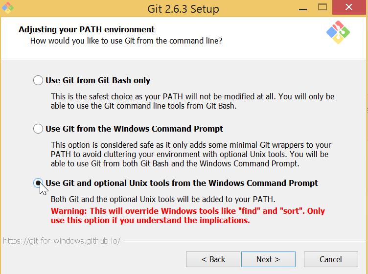

---
tags:
- msys2
- windows
- conemu
- docker
- microservice
- gradle
- sdkman
- lazybones
excerpt: |
  Java microservices - Create and run Docker containers on Windows
---
:imagesdir: /images

= Java microservices - Create and run Docker containers on Windows

[NOTE]
====
Following old habit I tend to avoid installation of tools that are planned to be used from command line to `C:\Program Files\` folder.
Instead, I'm using `c:\opt`, `d:\usr`, etc., i.e. folder name without spaces.
This guide will highlight steps where software is planned to be installed in folder different from `C:\Program Files\`. 
====

Glossary::

* _GIT-SCM_ - `Git For Windows` project, located at http://git-scm.com/download/win
* _Environment variable_ - `Windows` environment variables in this guide assumed to be managed via _Control Panel_
* _Uninstallation_ - delete software via _Control Panel_

== Docker Toolbox and Linux-like command line environment

`Docker Toolbox` is bundled with _GIT-SCM_, but installer has drawbacks

* No possibility to skip _GIT SCM_ installation
* No possibility to change _GIT SCM_ destination
* doesn't allow to change its parameters during installation.
* doesn't `git` and other tools to `PATH` environment variable

=== Setup MSYS2

Advantages over _GIT-SCM_::
* Built-in package manager `pacman`, ported from `Arch Linux` distributive
** Possiblitity to install arbitrary tools not included into `msys2` distributive
** Possibility to upgrade `msys2` core from command line
* Symlink support

Installation steps::
. Run installer from https://msys2.github.io/ and follow instructions
. Use `d:\opt\msys` as a destination folder
. After installation is completed add `d:\opt\msys\usr\bin` to `PATH` environment variable

=== Setup Docker Toolbox

Installation steps::
. Run `Windows` installer from https://www.docker.com/docker-toolbox and follow instructions
. Use `d:\opt\docker` as a destination folder
. After installation is completed, _uninstall GIT SCM_

=== Setup ConEmu

. Run installer from https://conemu.github.io/ and follow instructions, _alpha_ releases can be used

. Create `bash` task for running `bash` console
+
.ConEmu task for running msys2 bash settings
image::1.png[ConEmu task for running msys2 bash settings]

. Run new consoles in the same window
+
.ConEmu single window settings
image::2.png[ConEmu single window settings]

. Integrate with `Windows` shell
+
.ConEmu shell integration settings

+
.ConEmu shell integration result

=== How to check Docker software works

. Open new console in `ConEmu` with `Ctrl+X` shortcut
. Execute `/d/opt/docker/start.sh` from `bash` shell
. Execute `docker run hello-world` from `bash` shell
. Check output, it should looks like below, refer to http://docs.docker.com/windows/step_one/[Docker Guide^] for up to date output.

----
blah blah
----

=== docker-machine tool

* No need to interact with VirtualBox UI pure cmd line 
* Some useful commands

=== Improve Git experience

If you plan to use `git` for version control then pay attention to steps below, otherwise thise section can be skipped.

Line endings::
_GIT-SCM_ as well as other sources advice to use `core.autocrlf` equals to `true` while working with `git` on `Windows`.
Execute command below to set this parameter for all `git` repositories.

  $ git config --global core.autocrlf true

Password caching::
Working with remete repositories via HTTP / HTTPS requires entering user name password.
It's good to use _credentials helper_ that caches passwords, so there no need to type them each time. 
For `GitHub` it's easy and explained https://help.github.com/articles/caching-your-github-password-in-git/[in this article^].
But this approach doesnt't fit well with `BitBucket` repositories.
+
https://github.com/Microsoft/Git-Credential-Manager-for-Windows/[Git Credential Manager for Windows^] project works fine with both `GitHub` and `BitBucket`, but currently it can be used only with `git` installed via _GIT-SCM_ - https://github.com/Microsoft/Git-Credential-Manager-for-Windows/issues/70[track сorresponding issue^].
+
The solution is to use https://gitcredentialstore.codeplex.com/[Git Credential Manager for Windows predecessor^] that works fine with any `git` installation.

== Create JVM based app running in Docker container

=== Setup SDKMAN

* hack script replace `-h` to `-d`

=== Create and dockerize sample JVM application

* install `Gradle`
* install `LazyBones`
* `Gradle` plugin to generate project
* create main class
* create `Docker` image
* run `Docker` image from command line
