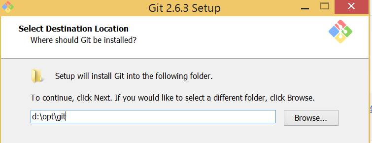

---
tags:
- windows
- docker
- microservice
- msys2
- conemu
excerpt: |
  Java microservices - how to run Docker containers on Windows
---
:imagesdir: /images
= Java microservices - how to run Docker containers on Windows

[NOTE]
====
Following old habit I tend to avoid installation of tools that are planned to be used from command line to `C:\Program Files\` folder.
Instead, I'm using `c:\opt`, `d:\usr`, etc., i.e. folder name without spaces.
This guide will highlight steps where software is planned to be installed in folder different from `C:\Program Files\`. 
====

Glossary::

* _GIT-SCM_ - `Git For Windows` project, located at http://git-scm.com/download/win
* _Environment variable_ - `Windows` environment variables in this guide assumed to be managed via _Control Panel_
* _Uninstallation_ - delete software via _Control Panel_

== Docker Toolbox and Linux-like command line environment

//All is contained in Docker Toolbox, but there are drawbacks
`Docker Toolbox` is bundled with _GIT-SCM_, but installer has such drawbacks

* No possibility to skip _GIT SCM_ installation
* No possibility to change _GIT SCM_ destination
* Not adding `git` and other tools to `PATH` environment variable

=== Setup MSYS2

//why Msys2 and not GIT SCM

Advantages over _GIT-SCM_::
* Built-in package manager `pacman`, ported from `Arch Linux` distributive
** Possibility to install arbitrary tools not included into `msys2` distributive
** Possibility to upgrade `MSYS2` core from command line
* Symlink support

Installation steps::
. Run installer from https://msys2.github.io/ and follow instructions
. Use `d:\opt\msys` as a destination folder
. After installation is completed add `d:\opt\msys\usr\bin` to `PATH` environment variable

By default `MSYS2` uses own directory for user home, so instead `C:\Users\` your home will be located in `d:\opt\msys\home` folder.
This behaviour can be overridden by setting environment variable `HOME` to preferred value.

=== Setup Docker Toolbox

Installation steps::
. Run `Windows` installer from https://www.docker.com/docker-toolbox and follow instructions
. Use `d:\opt\docker` as a destination folder
. After installation is completed, _uninstall GIT SCM_, we will use `msys2` installed before

=== Setup ConEmu

//simple bash window not enough, ConEmu provides multi console, tabbed interface, additional possibilities

. Run installer from https://conemu.github.io/ and follow instructions, _alpha_ releases can be used
. Create `ConEmu` task for running `bash` console and make it run on program startup
+
.ConEmu task for running MSYS2

. Run new consoles inside single `ConEmu` window
+
.ConEmu single window settings
image::2.png[ConEmu single window settings]

. Integrate with `Windows` shell, `CHERE_INVOKING` forces `MSYS` to use current directory as a working directory
+
.ConEmu shell integration settings
image::3.png[ConEmu shell integration settings]
+
.ConEmu shell integration result
image::4.png[ConEmu shell integration]

=== Verify that everything  works

. Start `ConEmu` program, should be started with new tab running `bash` console inside 
. Open new console in `ConEmu` with `Ctrl+X` hotkey, this is just to check `Ctrl+X` open
. Go to `/d/opt/docker/` folder
. Execute `./start.sh` command
. Then run `docker run hello-world`
. Check output, it should looks like below, refer to http://docs.docker.com/windows/step_one/[Docker Guide^] for latest actual information about the output

----
$ docker run hello-world

Hello from Docker.
This message shows that your installation appears to be working correctly.

To generate this message, Docker took the following steps:
 1. The Docker client contacted the Docker daemon.
 2. The Docker daemon pulled the "hello-world" image from the Docker Hub.
 3. The Docker daemon created a new container from that image which runs the
    executable that produces the output you are currently reading.
 4. The Docker daemon streamed that output to the Docker client, which sent it
    to your terminal.

To try something more ambitious, you can run an Ubuntu container with:
 $ docker run -it ubuntu bash

Share images, automate workflows, and more with a free Docker Hub account:
 https://hub.docker.com

For more examples and ideas, visit:
 https://docs.docker.com/userguide/
----

=== docker-machine tool

//No need to interact with VirtualBox UI pure cmd line 

* `docker-machine ls` - list machines and their statuses
* `docker-machine stop default` - stop default `VirtualBox` VM
* `docker-machine start default` - start default `VirtualBox` VM
* `docker-machine help` - more information :)

=== Improve Git experience

If you plan to use `git` then pay attention to steps below, otherwise this section could be skipped.

Line endings::
_GIT-SCM_ as well as other sources advice to use `core.autocrlf` equals to `true` while working with `git` on `Windows`.
Execute command below to set this parameter for all `git` repositories.

  $ git config --global core.autocrlf true

Password caching::
Working with remote repositories via HTTP / HTTPS requires entering user name password.
It's good to use _credentials helper_ that caches passwords, so there no need to type them each time. 
For `GitHub` it's easy and explained https://help.github.com/articles/caching-your-github-password-in-git/[in this article^].
But this approach doesn't fit well with `BitBucket` repositories.
+
https://github.com/Microsoft/Git-Credential-Manager-for-Windows/[Git Credential Manager for Windows^] project works fine with both `GitHub` and `BitBucket`, but currently it can be used only with `git` installed via _GIT-SCM_ - https://github.com/Microsoft/Git-Credential-Manager-for-Windows/issues/70[track сorresponding issue^].
+
The solution is to use https://gitcredentialstore.codeplex.com/[Git Credential Manager for Windows predecessor^] that works fine with any `git` installation.

