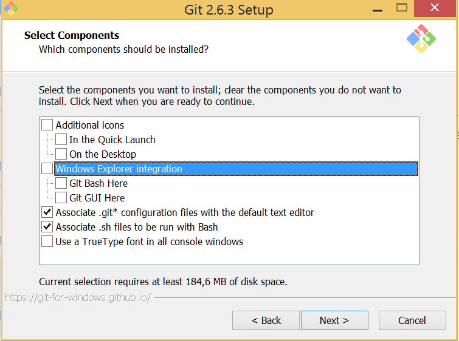

---
tags:
- java
- groovy
- spock
- javascript
- nashorn
- tdd
- jasmine
excerpt: |
  `JavaScript` usage is not restricted to client-side browser code or `NodeJS` powered server-side code.
  Many `JVM` based projects are also using it as internal scripting language.
  Testing this sort of functionality is neither straighforward nor standard.
  In this post I intend to show approach for testing `JavaScript` code in server-side JVM enviroinment 
  using well-known tools like `Jasmine`, `Spock` and `Nashorn`.
---
:imagesdir: /images/drafts
= Testing JVM server-side JavaScript using Jasmine, Spock and Nashorn

`JavaScript` is not only browser powered client-side or `NodeJS` powered server-side code.
Many `JVM` based projects are also using it as internal scripting language.
Testing this sort of functionality is neither straightforward nor standard.
In this post I intend to show approach for testing `JavaScript` code in server-side JVM environment
using well-known tools like `Jasmine`, `Spock` and `Nashorn`.

Using `JavaScript` as scripting engine inside JVM application has significant difference comparing to client-side coding.
There's no sufficient tools nowadays for the task of testing business script itself. Among disadvantages I'd like to outline following

* lack of integration with build and _Continuous Integration_ tools (Maven, Gradle, Jenkins, etc.)
* no good integration with IDEs
** no possibility to run single test from IDE
** unable to view test execution reports from IDE
* tight coupling to browser environment
* no possibility of using customized `JavaScript` executor

As far as I`ve seen most of the projects test business scripts by calling JS engine runner, 
passing script under test to it and doing assertion by inspecting side-effects.
Those approaches usually have similar drawbacks 

* hard to stub or mock something, usually ends up hacking on `prototype`
* hard to organize tests into suites and report test execution errors
* need too much orchestration
* custom test suite code for each project
* not leveraging robust JavaScript testing tools and frameworks

So, driven by the need for comfortable JavaScript testing tools we've created the setup I am going to describe below.

== Customized JavaScript executor

There's no need to conform standards in non-browser JS environments, so usually
developers extend scripting engine with custom functions, built-in variables etc.
It is extremely important to use exactly the same executor both for production and testing purposes.

Let's consider we have the runner accepting target script name, parameters and returning resulting value of the script.

[source,java]
----
----

== Jasmine setup

[source, javascript]
.jasmine-runner.js
----
<1>
----
<1> `Nashorn` specific code adjusting `Jasmine` for non-browser environments. Not a part of `Jasmine` distribution.

== Transforming Jasmine tests into Java world

Get Jasmine report from executor and create fake tests with Spock data provider

[source,groovy]
.Jasmine2Specification.groovy
----
<1>
----
<1> additional variable for data provider to underline ignored test

== Test example

[source,groovy]
.JavaScriptTest.groovy
----
----

image::1.png[]

Intellij Idea language injection

.Disadvantages
* unclear way of detecting line of source code particular where error happened
* still no ability to run single _specification_ from `Jasmine` suite
* incomplete reporting about ignored tests

NOTE: Full project's code is available at https://github.com/eshepelyuk/CodeForBlog/tree/master/TestMeIfYouCanNashornSpock[GitHub^]
